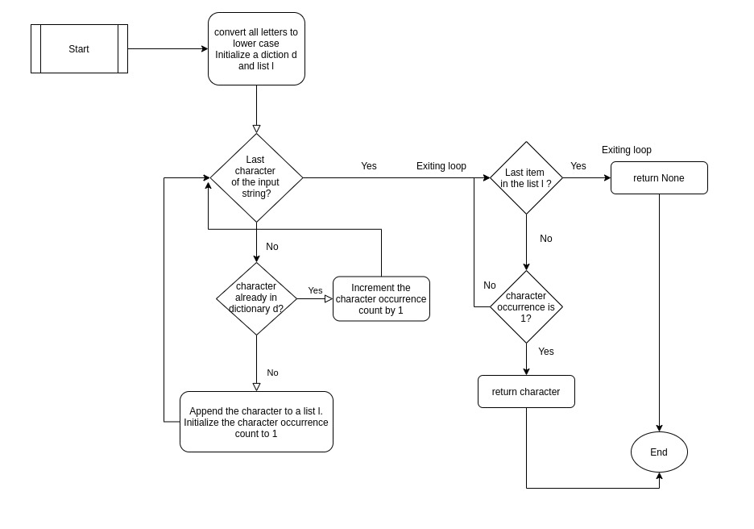
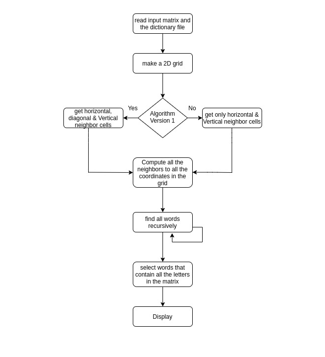

# String Processing in Python

This repository contains a couple of string processing tasks on python. The tasks are divided into Task 1 and Task 2 

## System Set-Up
* Python 3
* The programs are testing on a Linux machine


# Task 1 : 

To find and return the first character in a given string that is not repeated. The base algorithm to be checked for three scenarios: 

1. Given is the sequence ‘EntwicklerHeld’ where upper case and lower case letters are used interchangebly, the function should return ‘n’.  
2. Given is the sequence ‘abcabc’ – the function should return ‘None’.  
3. Given is the sequence ‘’ - the function should return ‘None’.

## Design

A brief flow diagram depicting the program execution is shown below



## Usage:

The program can be found in the folder Task1 in the current directory. The program file name is Find_First_Non_Repeating_Character.py. The input string to the program is given via the command line

1. To run with string "EntwicklerHeld":
     >python3 Task1/Find_First_Non_Repeating_Character.py "EntwicklerHeld"

       Output -- The first non repeating character of the string abcbc is -- e

2. To run with string "abcabc":
     >python3 Task1/Find_First_Non_Repeating_Character.py "abcabc"
     
       Output -- The first non repeating character of the string abcbc is -- None

3. To run with string "":
      >python3 Task1/Find_First_Non_Repeating_Character.py "abcabc"
      
       Output -- The first non repeating character of the string abcbc is -- None


# Task 2 :

To find the hidden word in a n*n matrix which is connected through a path. The words found should contain all the letters in the matrix

1. First Version: Only horizontal and vertical navigation to neighboring cells are considered
	- Given is the following n*n numpy array: ([A, M], [G, E]), the algorithm should output GAME.

2. Second Version: Horizontal, Vertical and Diagonal directions for navigation are considered.
	- Given is the following n*n numpy array: ([H, R], [Z, E]), the algorithm should find "HERZ"

## Design

Here is a brief overview that depicts the program execution



## Configuration

A Config.json file is present in the directory Configuration. Using this, the dictionary file, the input file and the version of the algorithm can be changed.

The configuration file looks as follows:
```
{
    "Dictionary": "Dictionary/words.txt",
    "Input_Matrix": "WordPuzzle.txt",
    "Algorithm_Version": 1
}
```
The dictionary file and the input file can be changed here in the config file. 

**The main field here being the Algorithm_Version**
```
1. "Algorithm_Version": 1 : This sets the Algorithm to first version where only horizontal and vertical navigations are allowed.
2. "Algorithm_Version": 2 : This sets the Algorithm to second version where horizontal, vertical and diagonal navigations are allowed.
```


## Usage:

- The program can be found in the folder Task2 in the current directory. The program file name is Word_Puzzle_Solver.py.

- The file WordPuzzle.txt is the main input to the program, the matrix can be edited by the user in the file. Adher to the format shown in the default example in the file

- The file words.txt present in the directory Dictionary, contains a list of english words that serves the purpose of the dictionary. More words can be manually added by editing the file

**Note: Please use the configuration file to select the version 1 or version 2 of the algorithm**

### Prerequisites:
- By default, a text file named "words.txt" containing the english words to be present in the Task2/Dictionary directory
- By defaut, a text file named "WordPuzzle.txt" containing the character matrix to be present in the Task2 directory.

### To execute 

1. At first, enter the Task2 directory
     >cd Task2/

2. For Version 1 ( enter in Configuration/Config.json file ),  run:
	- ( example prerequisite: edit the WordPuzzle.txt file to contain ([A, M], [G, E]) )
     >python3  Word_Puzzle_Solver.py

       When the given numpy array is ([A, M], [G, E]), the Output words are -- GAME
       ***************************************
       The Input Grid
       [['A' 'M']
       ['G' 'E']]
       
       ---- Diagonal search is OFF -------

       Found 1 words

       GAME
       ***************************************


3. For Version 2 ( enter in Configuration/Config.json file ), run:
     - ( example prerequisite: edit the WordPuzzle.txt file to contain ([A, M], [G, E]) )
	  >python3 Word_Puzzle_Solver.py

       When the given numpy array is ([H, R], [Z, E]), the output is:
       ***************************************
       The Input Grid
       [['H' 'R']
       ['Z' 'E']]
       
       ---- Diagonal search is ON --------

       Found 1 words

       HERZ
       ***************************************

## CONCLUSION

Both the tasks were implemented and executed successfully and adher to the requirement.
